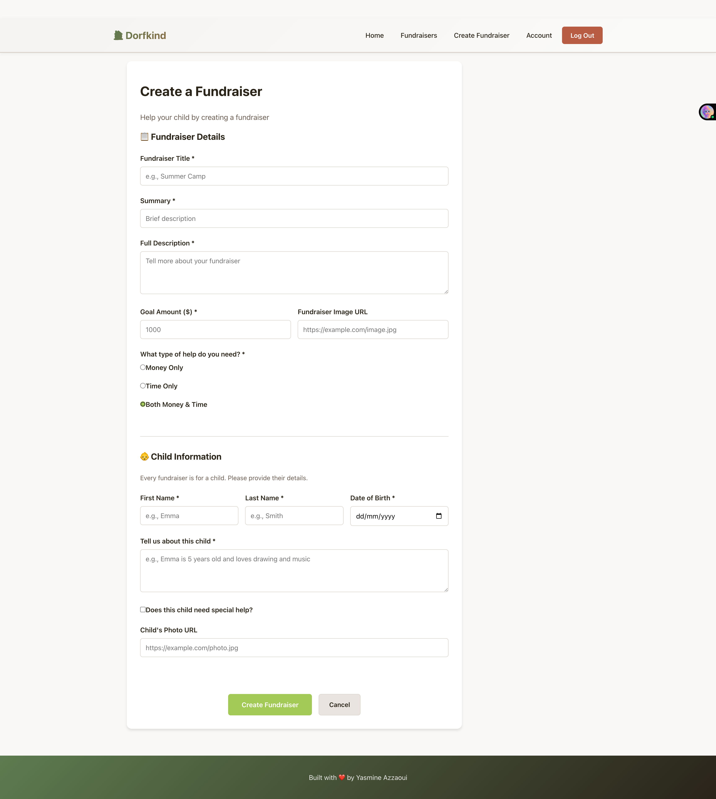
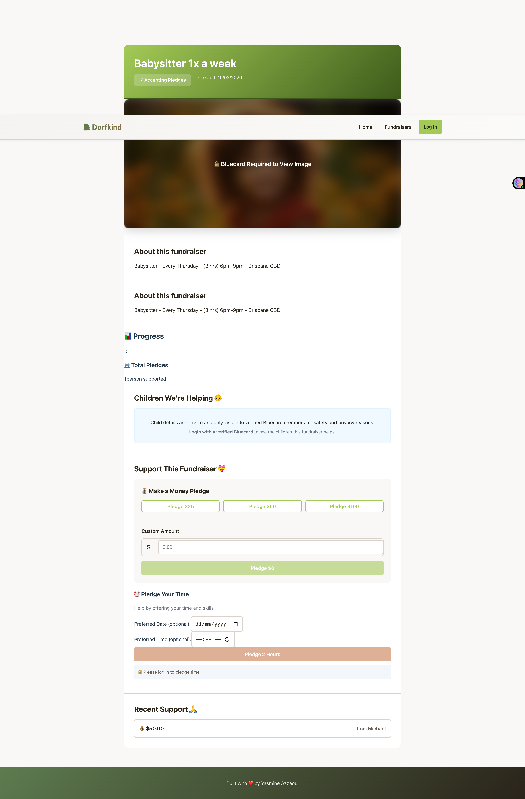

## Project Description

Kickstarter, Go Fund Me, Kiva, Change.org, Patreon… All of these different websites have something in common: they provide a platform for people to create fundraisers that they believe in, but they all have a slightly different approach. You are going to create your own crowdfunding website (this time the front-end), and put your own spin on it!

## Project Requirements

Here's a reminder of the required features. Your crowdfunding project must:

- [x] Be separated into two distinct projects: an API built using the Django Rest Framework and a website built using React.
- [x] Have a cool name, bonus points if it includes a pun and/or missing vowels. See https://namelix.com/ for inspiration. (Bonus Points are meaningless)
- [x] Have a clear target audience.
- [x] Have user accounts. A user should have at least the following attributes:
  - [x] Username
  - [x] Email address
  - [x] Password
- [x] Ability to create a “fundraiser” to be crowdfunded which will include at least the following attributes:
  - [x] Title
  - [x] Owner (a user)
  - [x] Description
  - [] Image
  - [x] Target amount to raise
  - [x] Whether it is currently open to accepting new supporters or not
  - [x] When the fundraiser was created
- [ ] Ability to “pledge” to a fundraiser. A pledge should include at least the following attributes:
  - [X ] An amount
  - [x] The fundraiser the pledge is for
  - [x] The supporter/user (i.e. who created the pledge)
  - [x] Whether the pledge is anonymous or not
  - [ ] A comment to go along with the pledge
- [x] Implement suitable update/delete functionality, e.g. should a fundraiser owner be allowed to update its description?
- [x] Implement suitable permissions, e.g. who is allowed to delete a pledge?
- [x] Return the relevant status codes for both successful and unsuccessful requests to the API.
- [x] Handle failed requests gracefully (e.g. you should have a custom 404 page rather than the default error page).
- [x] Use Token Authentication, including an endpoint to obtain a token along with the current user's details.
- [x] Implement responsive design.

## Additional Notes

No additional libraries or frameworks, other than what we use in class, are allowed unless approved by the Lead Mentor.

Note that while this is a crowdfunding website, actual money transactions are out of scope for this project.

## Submission

To submit, fill out [this Google form](https://forms.gle/34ymxgPhdT8YXDgF6), including a link to your Github repo. Your lead mentor will respond with any feedback they can offer, and you can approach the mentoring team if you would like help to make improvements based on this feedback!

Please include the following in your readme doc:

- [x] A link to the deployed project.
      https://lively-nasturtium-d3c5e8.netlify.app/
- [x] A screenshot of the homepage
      
      
- [x] A screenshot of the fundraiser creation page
      
- [x] A screenshot of the fundraiser creation form
      
- [x] A screenshot of a fundraiser with pledges
      
      
